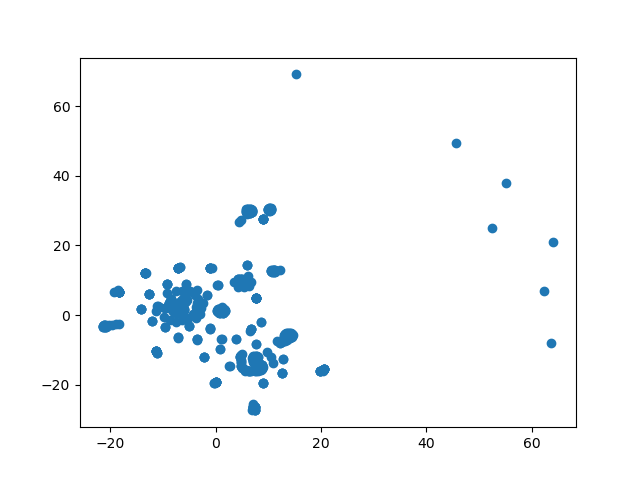
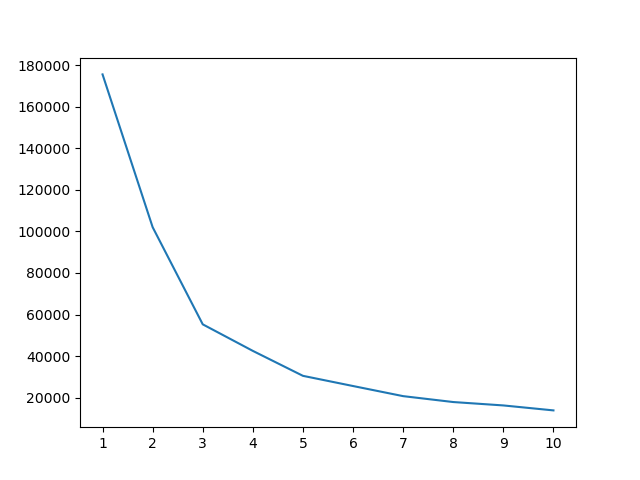

# Cryptocurrency Clusters

* The dataset was obtained from [CryptoCompare](https://min-api.cryptocompare.com/data/all/coinlist).

## Cluster Analysis with K-Means

* A series of tests were done clustering at different training levels, with different estimated cluster counts (k)

* The output for these can be found in the [Graphs](Graphs) folder

## Recommendation

* Based on my findings, training rates seemed to be optimal in the 20-60 range, with larger training values hiding a small potential cluster located very near one of the primary clusters and smaller values being sparse enough the clusters tended to overlap much more frequently

* Using the [results](Graphs/rate_50) with the training rate set to 50, the [K-means analysis](Graphs/rate_50/k_means_analysis.png) would support the presence of three clusters

## Graphs

### Cluster Plot with Training Rate of 50

### K-means Analysis/Elbow Plot

